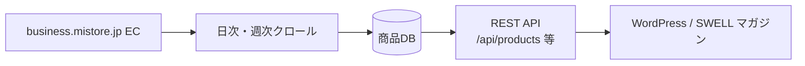

# マガジンリニューアル説明資料（クライアント向け）

対象サイト: [三越伊勢丹法人オンラインストアマガジン](https://business.mistore.jp/magazine/)  
本資料は、社内での費用対効果確認（運用負荷の軽減・商品情報連携によるUI向上）および、リニューアルに関する技術・運用上のご質問への回答用です。

---

## 1. サマリー（費用対効果の結論）

| 観点       | 現状                        | 施策後に期待できる効果                                        |
| -------- | ------------------------- | -------------------------------------------------- |
| 記事内の商品紹介 | 価格・画像・リンクを手作業で記事に埋め込み     | 商品コード指定＋API表示で、価格改定・販売終了の追従が自動化                    |
| 編集UI     | ブロックエディタではないため、レイアウト変更に手間 | SWELL（ブロックエディタ）により編集・差し替えが容易に                      |
| 日次の運用    | バナー・文言変更も編集コストが高い         | WordPressダッシュボード改善により、ご担当者様側での自走がしやすくなる            |
| SEO      | —                         | URLは変更しないため移行リスクは小さく、サイト構造・導線改善により SEO / AIO は改善方向 |

**主効果**: 商品情報の手メンテナンス削減と、編集・バナー差し替えの自走化です。正確な価格・販売状況・付帯情報の表示やショップへの導線強化により、マガジン記事からのUI・体験向上も見込めます。

---

## 2. API連携の仕組み（構成図・取得項目・更新フロー）

商品情報は、ECサイト（business.mistore.jp）から定期収集し、REST API経由でWordPress（SWELL）のマガジン記事へ提供する構成です。

マガジン記事向けの公開APIは **mi-business-online の商品API**（商品コード指定）を正面とします。すでに商品コードでの取得は可能ですが、サイト内検索などで運用している商品データ取得のノウハウを活かし、**ブランド・のし／包装・賞味期限・構造化在庫などの項目まで拡張したうえで本番連携**します。

### 2.1 構成図

| 構成要素              | 役割                              |
| ----------------- | ------------------------------- |
| ECサイト             | 商品の正（価格・画像・販売状況・付帯情報など）         |
| クロール／同期           | ECの商品ページを収集し、商品DBを更新（取得項目を拡充）   |
| 商品DB              | APIの参照元。新商品・販売終了の一覧にも利用         |
| REST API          | WordPressから商品コード指定で最新情報を取得      |
| WordPress / SWELL | 記事には商品コード等を指定し、表示時にAPIから最新情報を取得 |

### 2.2 取得できる主な項目（拡張後）

| 項目            | 説明                                                         |
| ------------- | ---------------------------------------------------------- |
| 商品コード         | 記事側で指定するキー                                                 |
| 商品名           | 表示用名称                                                      |
| ブランド名         | ブランド                                                       |
| カテゴリ / サブカテゴリ | 分類                                                         |
| 税込価格 / 税抜価格   | 価格表示                                                       |
| 商品説明          | 説明文                                                        |
| 商品URL         | ショップへのリンク                                                  |
| 画像URL（単一・複数）  | サムネイル・カード表示                                                |
| 販売状況（構造化）     | 販売中／一時欠品／取扱不可など（`in_stock` / `stock_kind` / `stock_label`） |
| のし／包装紙／紙袋     | 対応可否フラグ                                                    |
| 賞味期限（日数目安）    | ギフト選定の補助情報                                                 |
| 送料無料          | 該当可否                                                       |

主なAPI例:

- `GET /api/products?product_code[]=...` … 記事内の複数商品を一括取得
- `GET /api/products/[productCode]` … 商品詳細

※ 現状のAPIでも商品コード連携は可能です。上記の付帯情報まで記事カードに活かすため、商品APIを拡張してから本番の記事埋め込みに利用します。

### 2.3 更新フロー

1. **自動更新**
  - 差分クロール: 毎日 午前2時目安  
  - フルクロール: 週1回（例: 日曜 午前3時）
2. **手動更新（可能）**
  - 全体 / 差分クロールの即時実行  
  - 特定商品のみの単品クロール
3. **マガジン側の運用**
  - 記事には商品コード（ショートコード等）を指定  
  - ページ表示時にAPIから最新の価格・画像・販売状況・付帯情報を取得して表示

---

## 3. 更新頻度・手動更新・価格改定／販売終了時の挙動

**結論: API経由で反映できます。** 日次の自動更新に加え、必要時は手動クロールで即時反映も可能です。

| 事象            | 挙動                                                        |
| ------------- | --------------------------------------------------------- |
| **更新頻度**      | 差分は毎日自動、フルは週1。頻度は運用に応じて調整可能                               |
| **手動更新**      | 可能。単品・全体クロールAPIで即時反映できる                                   |
| **価格改定**      | 次回クロール成功時にDBの価格を上書き。記事HTMLの手修正は不要で、API表示が新価格に追随する         |
| **販売終了・在庫変化** | ECの販売状況を検出し、構造化在庫・販売状況として反映。記事の手修正は不要。ダッシュボードでも販売終了の把握が可能 |
| **鮮度の前提**     | クロール間隔内は一時的に旧情報が残る可能性がある（日次想定）。EC反映直後のリアルタイム保証ではない        |

---

## 4. 運用工数削減効果（現状比較）

費用対効果の中心は、**商品情報の手作業削減**と**編集UIの改善**です。

### 4.1 Before / After

| 作業               | 現状（Before）                    | 施策後（After）                    | 期待効果                   |
| ---------------- | ----------------------------- | ----------------------------- | ---------------------- |
| 商品情報の更新・追従       | 記事内に価格・画像・リンクを手で入れ、改定のたびに直し直し | 商品コード指定＋API。価格改定・販売終了はクロールで追随 | 記事ごとの商品メンテがほぼ不要に       |
| 商品情報の定期メンテ（参考試算） | 手動更新（例: 週1回・約2時間）             | 自動更新で手動作業が不要                  | **年間約100時間の削減**（社内試算例） |
| 記事の編集・レイアウト      | ブロックエディタでないため手間が大きい           | SWELLのブロックエディタ                | 作成・改修の作業時間短縮           |
| バナー・文言の差し替え      | 編集コストが高く、依頼・待ちが発生しやすい         | ダッシュボード改善によりご担当者様が自走しやすい      | 小さな修正のリードタイム短縮         |
| 読者向けの商品UI        | 手埋めのため古い価格・終売のまま残りやすい         | 最新価格・販売状況・付帯情報・ショップ導線を表示しやすい  | 信頼性・コンバージョン寄与の向上       |

### 4.2 UI向上として期待できる点

- 記事内商品カードの価格・画像・リンクが最新に近づく  
- 販売状況の表示制御・把握がしやすくなる（終売・欠品の取り違え防止）  
- のし・賞味期限などの付帯情報をカード／詳細に活かせる  
- マガジンからショップへの導線強化（記事／商品一覧の整理など）

※ 「年間約100時間」は、商品情報の定期手動更新を自動化した場合の試算例です。記事作成時の手埋め削減やブロックエディタ化の効果は、運用件数に応じてさらに上乗せされます。

---

## 5. SEOへの影響（URL・リダイレクト・title／meta）

**結論: URLは変わらないため、URL変更に伴うリダイレクトや順位毀損は想定しません。** テーマをSWELLに変更し、サイト構造・各ページ構成も改善するため、SEO / AIO は改善方向と考えています。

| 項目           | 見解                                                                             |
| ------------ | ------------------------------------------------------------------------------ |
| URL          | 変更しない → リダイレクト計画やURL移行によるリスクは発生しない想定                                           |
| リダイレクト       | URL維持のため、移行起因のリダイレクトは不要                                                        |
| title / meta | テーマ変更・ページ構成改善に伴い最適化の余地あり（悪化を前提としない）                                            |
| 構造・導線        | カテゴリ・記事構成・ショップ導線の改善により、検索・AI回答での発見性向上を期待                                       |
| 作業上の注意       | テーマ切替時は、既存のSEO設定（titleテンプレート、canonical、構造化データ等）の**引き継ぎ確認**を実施する（URL変更とは別の確認作業） |

---

## 6. 移行後の保守方針

| 領域             | 担当のイメージ           | 内容                                            |
| -------------- | ----------------- | --------------------------------------------- |
| **日次のコンテンツ運用** | 三越伊勢丹法人オンラインご担当者様 | WordPressダッシュボード改善により、バナー差し替え・文言変更などを自走しやすくする |
| **改善・保守**      | LIKEPASS          | 今回を機に LIKEPASS が直接改善保守できる体制へ。対応の迅速性と柔軟性が向上する  |
| **商品データ基盤**    | LIKEPASS          | クロールの稼働監視、必要時の手動クロール、APIの可用性・取得項目の維持          |

運用の分担を明確にすることで、「小さな修正は社内ですぐ」「基盤・改善はLIKEPASSが迅速に」という形を目指します。

---

## まとめ

1. **商品API連携**: EC → 日次クロール → DB → REST API（商品コード指定）→ SWELLマガジン。公開面は mi-business-online の商品APIとし、取得項目を拡充して利用します。
2. **価格改定・販売終了**: API反映可能（日次自動＋手動即時）。記事の手修正は原則不要です。
3. **工数削減**: 商品の手埋め・追従の削減（参考: 年間約100時間）に加え、ブロックエディタ化・ダッシュボード改善による編集負荷の軽減が見込めます。
4. **SEO**: URL維持のため移行リスクは小さく、構造改善により改善が期待できます。
5. **保守**: ご担当者様の自走しやすい編集環境と、LIKEPASSによる直接の改善保守で、迅速かつ柔軟な運用を目指します。

ご質問や、社内稟議用に数値・図の追加が必要な場合はお知らせください。

---

*最終更新: 2026-08-07*