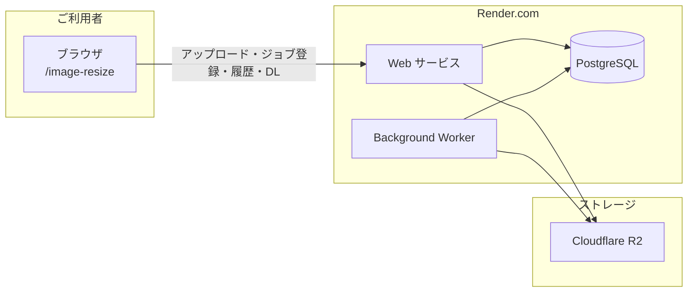

# 画像リサイズ・運用提案書（クライアント向け）

## はじめに

本ドキュメントでは、**画像リサイズ機能**（[https://mi-business-online.onrender.com/image-resize](https://mi-business-online.onrender.com/image-resize)）の仕様とサーバ構成、ならびに月額運用にかかる原価と**ご提案料金**をご説明します。ご検討の際の参考としてご活用ください。

---

## 1. 画像リサイズの仕様

### 1.1 概要

画像リサイズ機能は、ブラウザからアクセスする Web 画面でご利用いただけます。アップロードいただいた画像を、**大（640×533 ピクセル）** と **小（262×218 ピクセル）** の 2 サイズにリサイズし、ZIP でダウンロードできる形でお渡しします。アスペクト比は維持され、必要に応じて余白が付きます。

### 1.2 ご利用方法（2 種類）

| 種類 | 内容 | 目安 |
|------|------|------|
| **小規模** | 1 枚の画像、または ZIP（最大 30 枚・50MB まで）をその場でリサイズ | 画面上で即時処理・ダウンロード |
| **大容量バッチ（R2）** | 数千枚・数 GB 規模の ZIP をアップロードして一括リサイズ | ジョブ登録後、処理完了までお待ちいただき、完了後にダウンロード |

小規模の場合は画面に表示された結果をその場でダウンロードできます。大容量の場合は、ZIP をアップロードしてジョブを登録いただくと、サーバー側でリサイズ処理が実行されます。画面を閉じても処理は継続し、完了後は再ログインして「履歴」からリサイズ済み ZIP をダウンロードできます。

### 1.3 大容量バッチの流れ

1. ZIP を選択し「アップロードしてジョブ登録」を押す  
2. ブラウザからアップロード先（Cloudflare R2）へ ZIP を直接アップロード（進捗表示あり）  
3. ジョブ登録後、サーバー側でリサイズ処理が開始される（画面を閉じても処理は続行）  
4. 処理完了後、画面の「履歴」または表示されるリンクからリサイズ済み ZIP をダウンロードする  

**所要時間の目安**  
- アップロード：ZIP のサイズと回線速度により変動（数 GB の場合は十数分〜数十分のことがあります）  
- リサイズ処理：画像枚数・解像度により変動（数百枚で数分、数千枚で十数分〜数十分が目安）  
- ダウンロード：完了後に表示されるリンクから取得  

**限界値**  
- 1 ジョブあたり **最大 5,000 枚**まで  
- ZIP のサイズは R2 の制限内であれば数 GB 規模まで対応  

### 1.4 出力サイズ

| サイズ | ピクセル | 用途例 |
|--------|----------|--------|
| 大 | 640×533 | 一覧・詳細表示用 |
| 小 | 262×218 | サムネイル・一覧用 |

ジョブ登録時に「大」または「小」のいずれかを選択いただきます。

---

## 2. サーバ構成（画像リサイズまわり）

画像リサイズ機能は、次のコンポーネントで構成されています。

### 各コンポーネントの役割

| 構成要素 | 役割 |
|----------|------|
| **Web サービス** | 画像リサイズの画面（https://mi-business-online.onrender.com/image-resize）を提供します。ジョブの登録・一覧・完了日時・ダウンロード用 URL の発行、および小規模リサイズの即時処理を行います。 |
| **Background Worker** | 大容量バッチ用のリサイズ処理を担当します。一定間隔で未処理のジョブを取得し、R2 にアップロードされた ZIP を解凍・リサイズ・ZIP 化して R2 に保存します。 |
| **PostgreSQL** | ジョブの状態（待機中・処理中・完了・エラー）や入出力の情報を保持するジョブキュー用のデータベースです。Web と Worker の両方から参照されます。 |
| **Cloudflare R2** | 大容量バッチ用の入力 ZIP と、リサイズ後の出力 ZIP を保存するストレージです。アップロード・ダウンロードは R2 経由で行われます。 |

**まとめ**  
画像リサイズ機能は、**Web サービス**（画面・API）・**Background Worker**（バッチ処理）・**PostgreSQL**（ジョブ管理）・**Cloudflare R2**（ファイル保存）の 4 つで稼働しています。

---

## 3. 月額運営原価（画像リサイズ機能の運用）

画像リサイズ機能を継続して運用するためにかかっている月額の原価を、項目別に整理しました。為替は 1 ドル＝150 円で換算しています（実際の請求は各サービスでドル建てのため、レート変動時は再計算が必要です）。

| 項目 | サービス | 月額（円） | 備考 |
|------|----------|------------|------|
| Web サービス (mi-business-online) | Render | **3,750 円/月** | 画像リサイズ画面・ジョブ登録・履歴・ダウンロード URL 発行、小規模リサイズを提供。 |
| Background Worker (画像リサイズ用) | Render | **12,750 円/月** | 大容量バッチのリサイズ処理を実行。 |
| PostgreSQL (画像リサイズ用) | Render | **900 円/月** | ジョブキュー（待機・処理中・完了の管理）用。 |
| R2 ストレージ・リクエスト | Cloudflare | **約 0〜300 円/月（試算）** | 入出力 ZIP の保存。無料枠内なら 0 円、超過時は約 150〜300 円程度。エグレス無料。 |
| **インフラ合計** | — | **約 17,400〜17,700 円/月（試算）** | 上記の合計（画像リサイズ関連のみ。他機能と共有の Web は按分せず含む）。 |
| 管理コスト（運用・保守） | 運用担当 | **20,000 円/月** | 月 4 時間 × 5,000 円/時。監視・障害対応・定期更新・ドキュメント整備などを想定。 |
| **月額運営原価 合計** | — | **約 37,400〜37,700 円/月** | インフラ合計 ＋ 管理コスト。 |

※ R2 は利用量に応じて変動するため試算です。管理コストは、監視・障害対応・定期更新・ドキュメント整備などの工数（月 4 時間）に単価（5,000 円/時）を乗じて算出しています。  
※ 本表は画像リサイズ機能（https://mi-business-online.onrender.com/image-resize）の運用に係る原価の説明用です。Web サービスは他機能と共有のため、実務上は全体の月額原価を一体的にご提案しています（次節参照）。

---

## 4. ご提案料金（原価率 50%）

上記の仕様・構成・原価に基づき、**原価率 50%**（お見積もり金額の 50% が原価となる水準）で月額をご提案いたします。画像リサイズ機能の運用（インフラ・管理）に対する月額です。

- **月額運営原価**: 約 37,400〜37,700 円/月（画像リサイズ関連の原価をベースに、全体の運用原価を約 38,150〜38,450 円/月として換算した場合も同水準）
- **算出**: ご提案月額 ＝ 月額運営原価 ÷ 0.5（原価率 50%）
- **ご提案月額（税別）**: **77,000 円/月**

| 項目 | 金額（税別） |
|------|--------------|
| 月額ご提案料金 | **77,000 円/月** |
| 年額換算（参考） | 924,000 円/年 |

上記は**画像リサイズ機能**（https://mi-business-online.onrender.com/image-resize）の運用に対する月額のご提案です。ご不明点やご要望がございましたら、お気軽にお問い合わせください。

---

## 5. まとめ・次のステップ

- **画像リサイズ機能**は、https://mi-business-online.onrender.com/image-resize からご利用いただけます。小規模（1 枚 or ZIP 最大 30 枚・50MB）と大容量バッチ（最大 5,000 枚・数 GB 規模）の 2 通りでご利用可能です。
- 月額の運営原価（インフラ＋管理）を原価率 50% で換算した**ご提案月額は 77,000 円（税別）**です。
- 契約の流れ・お支払い条件・SLA など、詳細は別途ご相談させてください。

本提案書の内容についてご質問やご検討のご意向がございましたら、担当者までご連絡いただけますと幸いです。
